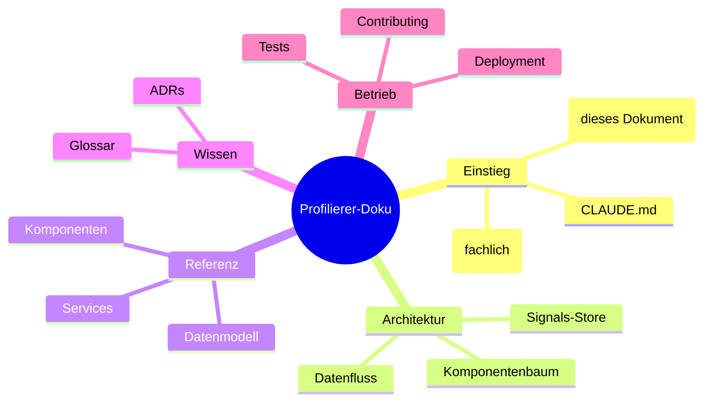

# XJustiz Profilierer — Dokumentation (Map of Content)

Zentraler Einstieg in die Entwickler- und Architekturdokumentation. Der **XJustiz Profilierer** visualisiert XJustiz-Nachrichten und erstellt Profilierungen (Kommunikationsszenarien) — auch für die Arbeit mit Nicht-Technikern. Diese MOC verlinkt alle Detaildokumente; die **fachliche Bedienung** steht im [Projekt-README](../README.md), das **Session-Handbuch** in [CLAUDE.md](../CLAUDE.md).

## Navigation

| Dokument                                                      | Wann lesen?                                                                                                                                    |
| ------------------------------------------------------------- | ---------------------------------------------------------------------------------------------------------------------------------------------- |
| [Architektur](architecture.md)                                | Big Picture: Schichten, Signals-Store, Komponentenbaum, Datenfluss (Mermaid)                                                                   |
| [Services](services.md)                                       | Was macht welcher Service, welche Kernmethoden                                                                                                 |
| [Datenmodell](data-model.md)                                  | Interfaces, Store-Signale, die pfad-indizierten Profil-Maps                                                                                    |
| [Komponenten](components.md)                                  | Feature-Komponenten mit Inputs/Outputs und Verantwortung                                                                                       |
| [Glossar](glossary.md)                                        | Baum-/Darstellungsbegriffe (Knoten, Kante, Blatt, Wurzel, Wert …) und ERV-/XJustiz-Fachbegriffe (XJustiz, Codeliste, Schematron, Ausprägung …) |
| [Tests](testing.md)                                           | Unit-Tests headless fahren, E2E-Muster, Testdaten                                                                                              |
| [Betrieb / Deployment](deployment.md)                         | Build, Hosting, die offene Prod-Proxy-Frage                                                                                                    |
| [Beitragen](contributing.md)                                  | Setup, Konventionen, Commit-/Branch-Stil                                                                                                       |
| [Architektur-Entscheidungen (ADRs)](adr/README.md)            | Warum wurde etwas so entschieden (Migration, Store, SVG-Linien, Proxy …)                                                                       |
| [User Stories](user-stories/xjustiz-nachricht-inspizieren.md) | Verfeinerte Anforderungen / Refinement-Ergebnisse (z. B. Nachricht inspizieren)                                                                |

## Für Claude / KI-Assistenz

- **Einstieg:** [CLAUDE.md](../CLAUDE.md) wird pro Session geladen und verweist auf diese MOC. Von hier aus zu den Detaildokumenten.
- **Provenienz:** Der Angular-Code trägt Kommentare mit Zeilenverweisen auf `legacy/Profilierer.html` (die frühere Single-File-Version). Verhalten lässt sich so 1:1 zurückverfolgen; die Doku nutzt dieselben Verweise.
- **Heiße Stellen:**
  - Zustand & Mutationen → `StateService` ([Services](services.md), [Datenmodell](data-model.md)); die kaskadierenden `removeAusp`-/`removeErweiterung`-Logiken und `pruneP` sind unit-getestet.
  - Schema-Parsing → `XsdParserService` (Index wird als Parameter durchgereicht).
  - SVG-Verbindungslinien → `TreeCanvas` (bewusst imperative DOM-Messung, siehe [ADR 0003](adr/0003-svg-verbindungslinien.md)).
  - Schema-Erweiterungen (Pfad-Schema `/~id`, Baum-Injektion, gelockerte Validierungs-Tore) → [ADR 0010](adr/0010-schema-erweiterungen-profil-overlay.md) + [US Schema-Erweiterung](user-stories/schema-erweiterung.md).
  - Profil-Versionen (Tabelle `profile_versions`, Hash-Entprellung, Restore-Fluss ohne Öffnen-Snapshot) → [US Profilierung versionieren](user-stories/profilierung-versionieren.md) + [Datenmodell](data-model.md).
- **Tests:** `npm run test:ci` (headless). Angular 20 braucht Node ≥ 22.12 — steht in `.nvmrc` und `engines`, notfalls `nvm use`.
- **Konvention:** deutschsprachige Bezeichner/Kommentare, standalone Components, Signals + OnPush; keine ungefragten Refactors.

## Dokumentenkarte

