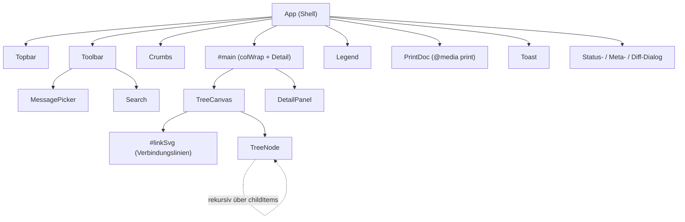
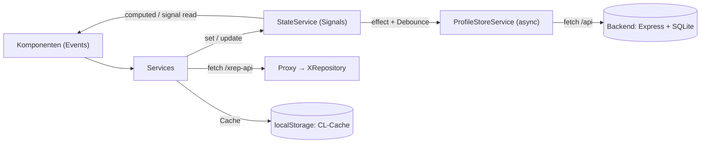
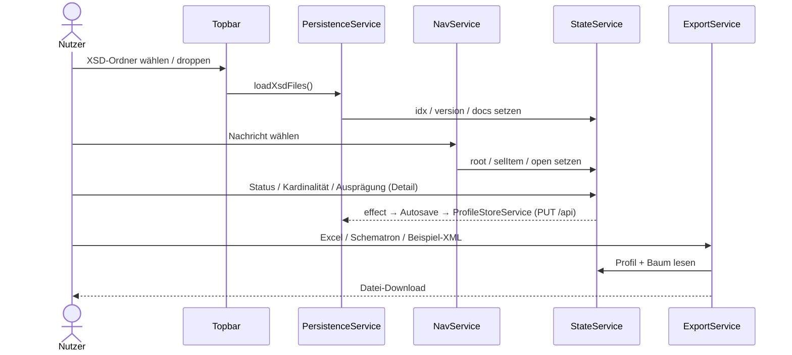
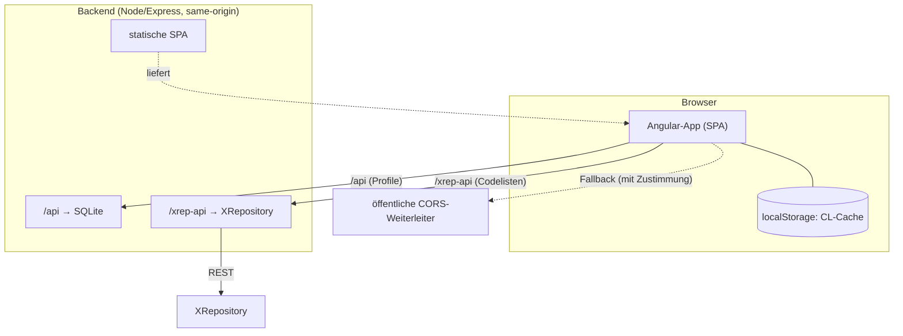

# Architektur

Big Picture des Angular-Projekts: Schichten, der Signals-Store als Zentrum, Komponentenbaum und Datenfluss. Für Detailreferenzen siehe [Services](services.md), [Datenmodell](data-model.md) und [Komponenten](components.md).

## Schichten

```
src/app/
  models/     Reine Interfaces (kein Verhalten)              → data-model.md
  core/
    services/ Zustand & Logik (13 Services)                  → services.md
    util/     Reine Helfer (xml.util, pretty.util)
    refs.ts   Referenz-Metadaten (Type.GDS.Ref.*)
  features/   Feature-Komponenten (Sichten)                  → components.md
  shared/     Querschnitt (Toast, FileDropDirective)
  app.ts      Shell: Komposition, Tastatur-Nav, Drop-Routing
  styles.scss Globale Styles (aus der Single-File-Version portiert)
```

**Grundprinzip:** `StateService` ist ein **Signals-Store** — je Zustandsfeld ein `signal`, abgeleitete Sichten als `computed`. Die frühere imperative `renderAll()`-Kaskade entfällt; Angulars Change Detection (OnPush) reagiert auf Signal-Änderungen. Services schreiben in den Store, Komponenten lesen daraus. Siehe [ADR 0002](adr/0002-signals-store.md).

## Komponentenbaum



`TreeNode` rendert sich rekursiv (Host-Klasse `ntree`, direkt darin `.box` + `.nkids`) — genau die DOM-Struktur, die `TreeCanvas` für die SVG-Linien vermisst.

## Datenfluss



Kein Two-Way-Binding: Aktionen laufen über Service-Methoden, die den Store mutieren; die Anzeige aktualisiert sich reaktiv. Mutationen der pfad-indizierten Maps erzeugen **neue Referenzen** (sonst feuert das Signal nicht) — siehe [Datenmodell](data-model.md).

## Typischer Ablauf



## Laufzeit-Kontext



Im Entwicklungsbetrieb übernimmt statt des Backends der `ng serve`-Dev-Proxy (`proxy.conf.json`) `/api` (→ localhost:3001) und `/xrep-api` (→ XRepository).

Der Dev-Proxy (`proxy.conf.json`) reicht XRepository-Aufrufe im Entwicklungsbetrieb same-origin durch. Für den Produktivbetrieb ist das offen — siehe [Deployment](deployment.md) und [ADR 0004](adr/0004-dev-proxy-xrepository.md).

## Heikelster Teil: SVG-Verbindungslinien

`TreeCanvas` berechnet die Bézier-Linien zwischen Eltern- und Kind-Kästen aus **DOM-Geometrie** (`getBoundingClientRect`). Neuberechnung wird ausgelöst durch einen `effect` (Struktur/Auswahl/Profil/Ansicht), einen `ResizeObserver` (Größe/Umbruch) und `afterNextRender` (Erstauf­bau), jeweils mit `requestAnimationFrame`-Debounce. Das ist der eine bewusst imperative DOM-Zugriff — Begründung in [ADR 0003](adr/0003-svg-verbindungslinien.md).
